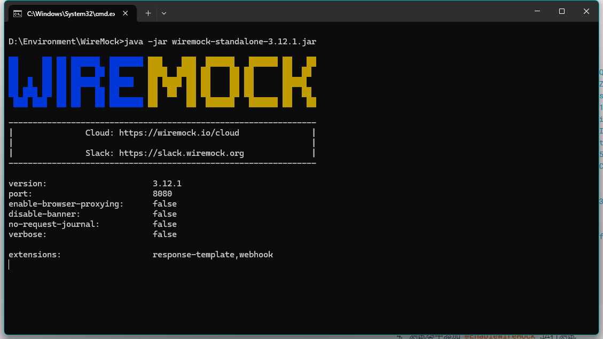
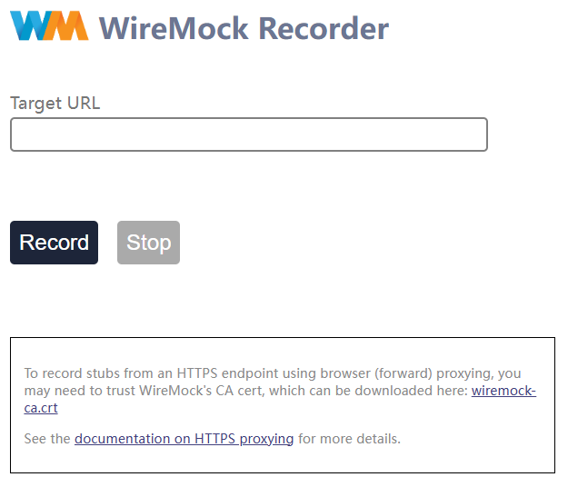
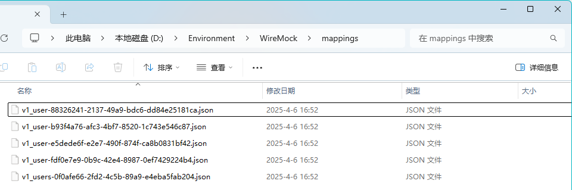

## QuickStar

1. 下载依赖

   ```xml
   <dependency>
       <groupId>org.wiremock.integrations</groupId>
       <artifactId>wiremock-spring-boot</artifactId>
       <version>${wiremock-spring-boot.version}</version>
   </dependency>
   ```

   

2. 设置 `FeignClient` 的url

   ```yaml
   spring:
     cloud:
       openfeign:
         client:
           config:
             user-service:
               url: ${wiremock.server.baseUrl}
   ```

   

3. 准备 `mappings`

   ```json
   {
     "mappings": [
       {
         "id": "1f966072-ad9d-4c50-b7d0-b925190b99fe",
         "name": "v1_user",
         "request": {
           "url": "/v1/user?id=1",
           "method": "GET"
         },
         "response": {
           "status": 200,
           "body": "{\"success\":true,\"code\":200,\"msg\":\"Success\",\"data\":{\"id\":1,\"name\":\"test\",\"age\":18}}",
           "headers": {
             "Keep-Alive": "timeout=60",
             "Date": "Sun, 06 Apr 2025 07:39:37 GMT",
             "Content-Type": "application/json"
           }
         },
         "uuid": "1f966072-ad9d-4c50-b7d0-b925190b99fe",
         "persistent": true,
         "insertionIndex": 1
       },
       {
         "id": "3292733d-49ad-4833-865a-4795f5ad0b35",
         "name": "v1_user",
         "request": {
           "url": "/v1/user",
           "method": "PUT",
           "bodyPatterns": [
             {
               "equalToJson": "{\"id\":1,\"name\":null,\"age\":null}",
               "ignoreArrayOrder": true,
               "ignoreExtraElements": true
             }
           ]
         },
         "response": {
           "status": 200,
           "body": "{\"success\":true,\"code\":200,\"msg\":\"Success\",\"data\":{\"id\":1,\"name\":\"updated\",\"age\":null}}",
           "headers": {
             "Keep-Alive": "timeout=60",
             "Date": "Sun, 06 Apr 2025 07:39:36 GMT",
             "Content-Type": "application/json"
           }
         },
         "uuid": "3292733d-49ad-4833-865a-4795f5ad0b35",
         "persistent": true,
         "insertionIndex": 5
       },
       {
         "id": "d266bc52-b927-4c3b-98d0-8f5d0b9b41a9",
         "name": "v1_user",
         "request": {
           "url": "/v1/user",
           "method": "POST",
           "bodyPatterns": [
             {
               "equalToJson": "{\"id\":null,\"name\":\"test\",\"age\":18}",
               "ignoreArrayOrder": true,
               "ignoreExtraElements": true
             }
           ]
         },
         "response": {
           "status": 200,
           "body": "{\"success\":true,\"code\":200,\"msg\":\"Success\",\"data\":{\"id\":1,\"name\":\"test\",\"age\":18}}",
           "headers": {
             "Keep-Alive": "timeout=60",
             "Date": "Sun, 06 Apr 2025 07:39:37 GMT",
             "Content-Type": "application/json"
           }
         },
         "uuid": "d266bc52-b927-4c3b-98d0-8f5d0b9b41a9",
         "persistent": true,
         "insertionIndex": 4
       },
       {
         "id": "4d6ad753-b4e3-48ec-8def-ae8f816cc587",
         "name": "v1_user",
         "request": {
           "url": "/v1/user?id=1",
           "method": "DELETE"
         },
         "response": {
           "status": 200,
           "body": "{\"success\":true,\"code\":200,\"msg\":\"Success\",\"data\":null}",
           "headers": {
             "Keep-Alive": "timeout=60",
             "Date": "Sun, 06 Apr 2025 07:39:37 GMT",
             "Content-Type": "application/json"
           }
         },
         "uuid": "4d6ad753-b4e3-48ec-8def-ae8f816cc587",
         "persistent": true,
         "insertionIndex": 3
       },
       {
         "id": "d73a996e-afa1-4343-a764-f95fd74fe47c",
         "name": "v1_users",
         "request": {
           "url": "/v1/users",
           "method": "GET"
         },
         "response": {
           "status": 200,
           "base64Body": "eyJpZCI6MSwibmFtZSI6InRlc3QxIiwiYWdlIjoxfQp7ImlkIjoyLCJuYW1lIjoidGVzdDIiLCJhZ2UiOjJ9CnsiaWQiOjMsIm5hbWUiOiJ0ZXN0MyIsImFnZSI6M30KeyJpZCI6NCwibmFtZSI6InRlc3Q0IiwiYWdlIjo0fQp7ImlkIjo1LCJuYW1lIjoidGVzdDUiLCJhZ2UiOjV9CnsiaWQiOjYsIm5hbWUiOiJ0ZXN0NiIsImFnZSI6Nn0KeyJpZCI6NywibmFtZSI6InRlc3Q3IiwiYWdlIjo3fQp7ImlkIjo4LCJuYW1lIjoidGVzdDgiLCJhZ2UiOjh9CnsiaWQiOjksIm5hbWUiOiJ0ZXN0OSIsImFnZSI6OX0KeyJpZCI6MTAsIm5hbWUiOiJ0ZXN0MTAiLCJhZ2UiOjEwfQp7ImlkIjoxMSwibmFtZSI6InRlc3QxMSIsImFnZSI6MTF9CnsiaWQiOjEyLCJuYW1lIjoidGVzdDEyIiwiYWdlIjoxMn0KeyJpZCI6MTMsIm5hbWUiOiJ0ZXN0MTMiLCJhZ2UiOjEzfQp7ImlkIjoxNCwibmFtZSI6InRlc3QxNCIsImFnZSI6MTR9CnsiaWQiOjE1LCJuYW1lIjoidGVzdDE1IiwiYWdlIjoxNX0KeyJpZCI6MTYsIm5hbWUiOiJ0ZXN0MTYiLCJhZ2UiOjE2fQp7ImlkIjoxNywibmFtZSI6InRlc3QxNyIsImFnZSI6MTd9CnsiaWQiOjE4LCJuYW1lIjoidGVzdDE4IiwiYWdlIjoxOH0K",
           "headers": {
             "Keep-Alive": "timeout=60",
             "Date": "Sun, 06 Apr 2025 07:39:37 GMT"
           }
         },
         "uuid": "d73a996e-afa1-4343-a764-f95fd74fe47c",
         "persistent": true,
         "insertionIndex": 2
       }
     ]
   }
   ```

   

4. 测试类中添加 `@EnableWireMock` ,运行测试


## Record

1. 下载 standalone jar

   https://repo1.maven.org/maven2/org/wiremock/wiremock-standalone/3.12.1/wiremock-standalone-3.12.1.jar

2. 运行

   ```shell
   java -jar wiremock-standalone-3.12.1.jar
   ```

   

3. 访问UI

   http://localhost:8080/__admin/recorder

   

4. 在 `Target URL` 中输入 远程服务的URL `http://localhost:8081`

5. 点击 `Record` 按钮

6. 启动远程服务

7. 修改测试用例，将 FeignClient的 url 修改为 `WireMock` 实例url `http://localhost:8080`

8. 运行测试用例

9. 点击UI中的 `Stop` 按钮

   捕获到的 `mapping` 会在 wiremock-standalone jar 同级的 `mappings` 目录下

   


## Stub Case

### Remote Service API & FeignClient

```java
// RemoteService
@RestController
@RequestMapping("/v1")
@Slf4j
@RequiredArgsConstructor
public class UserController {
    private final ObjectMapper objectMapper;

    @PostMapping(value = "user", consumes = {MediaType.APPLICATION_JSON_VALUE}, produces = {MediaType.APPLICATION_JSON_VALUE})
    public ResponseEntity<ResultResponse<User>> create(@RequestBody @Validated User user) {
        log.info("create user: {}", user);
        var data = user.setId(1L);
        return ResponseEntity.ok(ResultResponse.success(data));
    }

    @GetMapping(value = "user", produces = {MediaType.APPLICATION_JSON_VALUE})
    public ResponseEntity<ResultResponse<User>> retrieve(@RequestParam Long id) {
        log.info("get user info, id: {}", id);
        var user = User.builder().id(1L).name("test").age(18).build();
        return ResponseEntity.ok(ResultResponse.success(user));
    }

    @PutMapping(value = "user", consumes = {MediaType.APPLICATION_JSON_VALUE}, produces = {MediaType.APPLICATION_JSON_VALUE})
    public ResponseEntity<ResultResponse<User>> update(@RequestBody @Validated User user) {
        log.info("update user info, user: {}", user);
        return ResponseEntity.ok(ResultResponse.success(user.setId(1L).setName("updated")));
    }

    @DeleteMapping(value = "user", produces = {MediaType.APPLICATION_JSON_VALUE})
    public ResponseEntity<ResultResponse<Void>> delete(@RequestParam Long id) {
        log.info("delete user, id: {}", id);
        return ResponseEntity.ok(ResultResponse.success());
    }

    @GetMapping(value = "users", produces = {MediaType.APPLICATION_JSON_VALUE})
    public ResponseEntity<StreamingResponseBody> extract() {
        log.info("extract user info");
        var users = new ArrayList<User>();
        for (int i = 1; i <= 18; i++) {
            var user = User.builder().id((long) i).name("test" + i).age(i).build();
            users.add(user);
        }
        StreamingResponseBody streamingResponseBody = outputStream -> {
            for (User user : users) {
                outputStream.write(objectMapper.writeValueAsBytes(user));
                outputStream.write("\n".getBytes());
            }
        };
        return ResponseEntity.ok(streamingResponseBody);
    }
}
```

```java
// FeignClient
@Service
@FeignClient(name = "user-service", path = "/v1")
public interface UserRemoteService {

    @PostMapping(value = "/user", consumes = MediaType.APPLICATION_JSON_VALUE, produces = MediaType.APPLICATION_JSON_VALUE)
    ResponseEntity<ResultResponse<User>> createUser(@RequestBody User user);

    @GetMapping(value = "/user", produces = MediaType.APPLICATION_JSON_VALUE)
    ResponseEntity<ResultResponse<User>> retrieveUser(@RequestParam Long id);

    @PutMapping(value = "/user", consumes = MediaType.APPLICATION_JSON_VALUE, produces = MediaType.APPLICATION_JSON_VALUE)
    ResponseEntity<ResultResponse<User>> updateUser(@RequestBody User user);

    @DeleteMapping(value = "/user", produces = MediaType.APPLICATION_JSON_VALUE)
    ResponseEntity<ResultResponse<Void>> deleteUser(@RequestParam Long id);

    @GetMapping(value = "/users", produces = MediaType.APPLICATION_JSON_VALUE)
    Response extractUsers();
}
```

对于返回体为StreamingResponseBody类型的API，在FeignClient中请使用 `feign.Response` 

收到`feign.Response`  后，通过 `inputStream` 反序列化出所需结果

```java
@GetMapping(value = "users", produces = {MediaType.APPLICATION_JSON_VALUE})
public ResponseEntity<ResultResponse<List<User>>> extractUsers() throws IOException {
    var userList = new ArrayList<User>();
    try (Response response = userRemoteService.extractUsers()) {
        var inputStream = response.body().asInputStream();
        var reader = new BufferedReader(new InputStreamReader(inputStream));
        String line;
        while ((line = reader.readLine()) != null) {
            log.debug(line);
            var user = objectMapper.readValue(line, User.class);
            userList.add(user);
        }
    }
    return ResponseEntity.ok(ResultResponse.success(userList));
}
```

### POST SUCCESS

1. STUB

   ```java
   wireMock.stubFor(WireMock.post(WireMock.urlEqualTo("/v1/user"))
           .withRequestBody(WireMock.equalToJson(objectMapper.writeValueAsString(user)))
           .willReturn(WireMock.aResponse()
                   .withStatus(200)
                   .withHeader(HttpHeaders.CONTENT_TYPE, MediaType.APPLICATION_JSON_VALUE)
                   .withBody("""
                           {
                               "success": true,
                               "code": 200,
                               "msg": "Success",
                               "data": {
                                   "id": 1,
                                   "name": "test",
                                   "age": 18
                               }
                           }
                           """)));
   ```

2. VERIFY

   ```JAVA
   wireMock.verify(WireMock.postRequestedFor(WireMock.urlEqualTo("/v1/user"))
           .withRequestBody(WireMock.equalToJson(objectMapper.writeValueAsString(user))));
   ```

### POST FAILED

1. STUB

   ```java
   wireMock.stubFor(WireMock.post(WireMock.urlEqualTo("/v1/user"))
           .withRequestBody(WireMock.equalToJson(objectMapper.writeValueAsString(user)))
           .willReturn(WireMock.aResponse()
                   .withStatus(500)
                   .withHeader(HttpHeaders.CONTENT_TYPE, MediaType.APPLICATION_JSON_VALUE)
                   .withBody("""
                           {
                                "success": false,
                                "code": 500,
                                "msg": "Connection refused: getsockopt executing POST ${wiremockBaseUrl}/v1/user",
                                "data": null
                            }
                           """.replace("${wiremockBaseUrl}", wiremockBaseUrl))));
   ```

2. VERIFY

   ```java
   wireMock.verify(WireMock.postRequestedFor(WireMock.urlEqualTo("/v1/user"))
           .withRequestBody(WireMock.equalToJson(objectMapper.writeValueAsString(user))));
   ```

### GET SUCCESS

1. STUB

   ```java
   wireMock.stubFor(WireMock.get(WireMock.urlPathEqualTo("/v1/user"))
           .withQueryParam("id", WireMock.equalTo("1"))
           .willReturn(WireMock.ok()
                   .withHeader(HttpHeaders.CONTENT_TYPE, MediaType.APPLICATION_JSON_VALUE)
                   .withBody("""
                           {
                               "success": true,
                               "code": 200,
                               "msg": "Success",
                               "data": {
                                   "id": 1,
                                   "name": "test",
                                   "age": 18
                               }
                           }
                           """)));
   ```

2. VERIFY

   ```
   wireMock.verify(WireMock.getRequestedFor(WireMock.urlPathEqualTo("/v1/user"))
           .withQueryParam("id", WireMock.equalTo("1")));
   ```

### GET FAILED

1. STUB

   ```java
   wireMock.stubFor(WireMock.get(WireMock.urlPathEqualTo("/v1/user"))
           .withQueryParam("id", WireMock.equalTo("1"))
           .willReturn(WireMock.serverError()
                   .withHeader(HttpHeaders.CONTENT_TYPE, MediaType.APPLICATION_JSON_VALUE)
                   .withBody("""
                           {
                               "success": false,
                               "code": 500,
                               "msg": "Connection refused: getsockopt executing GET ${wiremockBaseUrl}/v1/user?id=1",
                               "data": null
                           }
                           """.replace("${wiremockBaseUrl}", wiremockBaseUrl))));
   ```

2. VERIFY

   ```java
   wireMock.verify(WireMock.getRequestedFor(WireMock.urlPathEqualTo("/v1/user"))
           .withQueryParam("id", WireMock.equalTo("1")));
   ```

### PUT SUCCESS

1. STUB

   ```java
   wireMock.stubFor(WireMock.put(WireMock.urlEqualTo("/v1/user"))
           .withRequestBody(WireMock.equalToJson(objectMapper.writeValueAsString(user)))
           .willReturn(WireMock.ok("""
                           {
                               "success": true,
                               "code": 200,
                               "msg": "Success",
                               "data": {
                                   "id": 1,
                                   "name": "updated",
                                   "age": null
                               }
                           }
                           """)
                   .withHeader(HttpHeaders.CONTENT_TYPE, MediaType.APPLICATION_JSON_VALUE)));
   ```

2. VERIFY

   ```java
   wireMock.verify(WireMock.putRequestedFor(WireMock.urlEqualTo("/v1/user"))
           .withRequestBody(WireMock.equalToJson(objectMapper.writeValueAsString(user))));
   ```

### PUT FAILED

1. STUB

   ```java
   wireMock.stubFor(WireMock.put(WireMock.urlEqualTo("/v1/user"))
           .withRequestBody(WireMock.equalToJson(objectMapper.writeValueAsString(user)))
           .willReturn(WireMock.serverError()
                   .withHeader(HttpHeaders.CONTENT_TYPE, MediaType.APPLICATION_JSON_VALUE)
                   .withBody("""
                           {
                               "success": false,
                               "code": 500,
                               "msg": "Connection refused: getsockopt executing PUT ${wiremockBaseUrl}/v1/user",
                               "data": null
                           }
                           """.replace("${wiremockBaseUrl}", wiremockBaseUrl))));
   ```

2. VERIFY

   ```
   wireMock.verify(WireMock.putRequestedFor(WireMock.urlEqualTo("/v1/user"))
           .withRequestBody(WireMock.equalToJson(objectMapper.writeValueAsString(user))));
   ```

### DELETE SUCCESS

1. STUB

   ```java
   wireMock.stubFor(WireMock.delete(WireMock.urlPathEqualTo("/v1/user"))
           .withQueryParam("id", WireMock.equalTo("1"))
           .willReturn(WireMock.okJson("""
                   {
                       "success": true,
                       "code": 200,
                       "msg": "Success",
                       "data": null
                   }
                   """)));
   ```

2. VERIFY

   ```java
   wireMock.verify(WireMock.deleteRequestedFor(WireMock.urlPathEqualTo("/v1/user"))
           .withQueryParam("id", WireMock.equalTo("1")));
   ```

### DELETE FAILED

1. STUB

   ```java
   wireMock.stubFor(WireMock.delete(WireMock.urlPathEqualTo("/v1/user"))
           .withQueryParam("id", WireMock.equalTo("1"))
           .willReturn(WireMock.serverError()
                   .withHeader(HttpHeaders.CONTENT_TYPE, MediaType.APPLICATION_JSON_VALUE)
                   .withBody("""
                           {
                                "success": false,
                                "code": 500,
                                "msg": "Connection refused: getsockopt executing DELETE ${wiremockBaseUrl}/v1/user?id=1",
                                "data": null
                            }
                           """.replace("${wiremockBaseUrl}", wiremockBaseUrl))));
   ```

2. VERIFY

   ```java
   wireMock.stubFor(WireMock.delete(WireMock.urlPathEqualTo("/v1/user"))
           .withQueryParam("id", WireMock.equalTo("1"))
           .willReturn(WireMock.serverError()
                   .withHeader(HttpHeaders.CONTENT_TYPE, MediaType.APPLICATION_JSON_VALUE)
                   .withBody("""
                           {
                               "success": false,
                               "code": 500,
                               "msg": "[500] during [DELETE] to [${wiremockBaseUrl}/v1/user?id=1] [UserRemoteService#deleteUser(Long)]: [{"success":false,"code":500,"msg":"Internal Server Error","data":null}]",
                               "data": null
                           }
                           """.replace("${wiremockBaseUrl}", wiremockBaseUrl))));
   ```


> 请注意 `urlEqualTo` 和 `urlPathEqualTo` 的区别
>
> [Matching and filtering HTTP requests in WireMock | WireMock](https://wiremock.org/docs/request-matching/)

> 对于 StreamingResponseBody类型的API
>
> 尽管 RemoteService 返回 500, 调用端仍然会从response中取 inputStream 并反序列化,而不会抛出异常.所以对这种类型的API请手动处理

